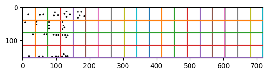

# Cell detection for golf cards

# Why && objectives

The way players annotate the results during a competition, or a round of it, is by writing down each different hole result in a little cardboard that is, itself, divided in a grid pattern. Once the round is over the cards are given to the organization that manually inputs the strikes of each player.

Inputting all the player's strikes takes time and I thought it was a prefect problem for computer vision and machine learning. Computer vision to determine where in the card is the information we want; and machine learning to take that information as an image and transform it to values we can work with.

In this entry I will center myself in creating a proof of concept of how the computer vision part might be achieved. The goal is not to create a perfect program to do the task but to find the best strategies to approach the task at hand.

# The card

There are different sections to the card:

- What we would call "*metadata*", things like date, competition, information about the different holes, etc. (marked in green).
- Overall fields, where players sum strikes and do post calculations (marked in blue).
- The marker's strikes, to compare at the end of the round the results (marked in red).
- The tracking cells, were the important information is (marked in orange). It's usually the first row the only one that gets used during a competition, but in training sessions the other rows might be used to keep track of other things like putts per hole, the number of strikes it took to get to green, etc.


For this study I will use a "skeleton card" made only of the parts the great majority of golf cards share plus markers to identify the important zone. I decided to include the markers because it is not far fetched idea to add little markers to a golf card as part of the design that will ease drastically the detection.

My card:


# Tools

For this project I will use python for it is ease of use, fast prototyping and the available libraries for computer vision it has.

I will be using `skimage` for computer vison, `matplotlib` for plotting the results and `numpy` for handling data structures.

# Steps

## Load the image

In this version we will work on the assumption that the image we receive will always be a PNG. The only thing we have to make sure is we are working with a RGB type of image instead of a RGBa type.
Checking the number of values the matrix retains for each pixel should do the trick, as for RGB you anly hold 3 but for RGBa you hold 4.

```python
def load_img(image_path:str) -> np.ndarray:
    # Load data from file
    img:np.ndarray = io.imread(image_path)

    if img.shape[2] == 4:
        # RGBA => RGB
        img = rgba2rgb(img)
    return img
```

```python
img = load_img('bitmap1.png')
plot_img(img)
```


## Find the area between the red markers

```python
def search_data_area(img:np.ndarray) -> np.ndarray:

    img2 = img.copy()

    # 1 - FIND THE RED MARKERS
    # Red markers enclouse the area
    red = np.logical_and(img[:,:, 0] > 0.8, img[:,:,1] < 0.8)
    not_red = np.logical_or(img[:, :, 0] < 0.8, img[:, :, 1] > 0.8)

    # 2 - HIGH CONTRAST
    # Make the red markers white and everything else black
    img[not_red] = [0., 0., 0.]
    img[red] = [1., 1., 1.]
    img = rgb2gray(img)

    # 3 - CORNER DETECTION TO FIND THE BOUNDRIES OF THE MARKERS
    coords = corner_peaks(corner_harris(img), min_distance=5, threshold_rel=0.4)

    # 4 - GIVEN ALL COORDS, DIVEDE THEM INTO THE 4 CLUSTERS AND FIND THE CENTER
    coords = center_of_clusters(coords, img.shape[0], img.shape[1])

    # 5 - DELETE THE RED MARKERS // To avoid future interference
    img2[red] = [1., 1., 1.]

    # 6 - CUT THE IMAGE TO THE AREA WE CARE
    img2 = img2[ coords[0][0] : coords[3][0], coords[0][1] : coords[3][1] ]

    return img2
```

```python
area_img = search_data_area(img)
plot_img(area_img)
```


### Finding the 4 clusters of points' centers

The function used in step 4 of the previous section `center_of_clusters` gets all the points the corner detection algorithm returns (points which come from the 4 different red markers) and mashes them together into four clusters, using each point's coordinates, to calculate the center point of each of the clusters

```python
def center_of_clusters(cluster_coors:np.ndarray, height:int, width:int) -> np.array:
    # We know there are 4 clusters but not how many dots in each cluster
    # Knowing the distribution we can separate them by position given where
    # they are in the image, topRight, topLeft, bottomRight and bottomLeft
    mid_h = height / 2
    mid_w = width / 2

    # ....[<nPoints in cluster>, <Sum of y coords>, <Sum of x coords>]...
    clusters = [[0,0,0],[0,0,0],[0,0,0],[0,0,0]]

    # Classify coordinates
    for y,x in cluster_coors:
        if y < mid_h:
            if x < mid_w:
                i = 0
            else:
                i = 1
        else:
            if x < mid_w:
                i = 2
            else:
                i = 3
        clusters[i][0] += 1  # Number of points in this cluster
        clusters[i][1] += y  # Sum of all y coords of the cluster
        clusters[i][2] += x  # Sum of all x coords of the cluster

    # Find the centers for each clusters
    return np.array([[sum_y//total, sum_x//total] for total, sum_y, sum_x in clusters])
```

## Extract cells in the area

### Pre-process: High contrast

It will help the line detection algorithm transforming the area into a high contrast area

```python
gray_area = rgb2gray(area_img)	# Needed for threshold_otsu func
t = threshold_otsu(gray_area)

area_bw = gray_area < t			# Dark background
area_wb = gray_area > t			# Light background
plot_img(are_bw)
```


### Find grid lines

```python
def grid_lines(info_area:np.ndarray):

    # 1 - LINE DETECTION ALGORITHM
    lines = probabilistic_hough_line(info_area, threshold=10, line_length=150,line_gap=15)

    # 2 - Split by orientation (vertial | horizontal)
    vertical = []
    horizontal = []

    # P = starting point of the line; Q = ending point of the line;
    for p, q in lines:
        m = None # y = mx+b

        if p[0] == q[0]:
            # Completly vertical, special case because the slope here is infinite
            # as it results from a division by 0 if we follow the usual forumula for the slope
            m = 900
        elif p[1] == q[1]:
            # Completly horizontal
            m = 0.0
        else:
            # Slope formula: m = q.y - p.y / q.x - p.x
            #m = (q[1] - p[1]) / (q[0]-p[0])
            pass

        # print(m)
        if m == None:
            continue
        if abs(0 - m) < abs(900 - m):
            horizontal.append((p, q))
        else:
            vertical.append((p, q))

    # 3 - ADD GRID LIMITS IN CASE THE LINE DETECTION ALGORITH DIDN'T FIND THEM
    x_end = info_area.shape[1] - 1
    y_end = info_area.shape[0] - 1
    vertical.append( ( (0, 0), (0, y_end) ) )
    vertical.append( ( (x_end, 0), (x_end, y_end) ) )
    horizontal.append( ( (0, 0), (x_end, 0) ) )
    horizontal.append( ( (0, y_end), (x_end, y_end) ) )

    # 4 - MERGE LINES THAT ARE TOO CLOSE(5px)
    vertical = merge_lines(vertical, threshold=5, vertical=True)
    horizontal = merge_lines(horizontal, threshold=5, vertical=False)

    # 5 - SORT THE LINES
    vertical.sort(key=lambda tup: tup[0][0])
    horizontal.sort(key=lambda tup: tup[0][1])

    # 6 - ELONGATE THE LINES TO MAKES SURE THE GRID IS ACROSS THE IMAGE
    vertical = [((p[0], info_area.shape[0]-1), (q[0], 0)) for p,q in vertical]
    horizontal = [((info_area.shape[1]-1, p[1]), (0, q[1])) for p,q in horizontal]

    return vertical, horizontal
```

```python
vertical, horizontal = grid_lines(area_bw)
grid = vertical + horizontal

fig, axes = plt.subplots()
axes.imshow(area_wb, cmap='gray')
for line in grid:
    p, q = line
    axes.plot((p[0],q[0]),(p[1], q[1]))
plt.show()
```



### Get grid's intersection points

Given the two sets of lines we only need to check where they intersect with each other inside all the area

```python
def cell_coords(vertical:list, horizontal:list, shape:tuple) -> np.ndarray:
    top = shape[0]
    end = shape[1]+

    # 1- GET VERTICAL CUTTING POINTS ON THE HORIZONTAL AXIS
    where2cutV = [p[0] for p,_ in vertical]

    # Assure start and end are included
    if not 0 in where2cutV:
        where2cutV = [0] + where2cutV
    if not shape[1]-1 in where2cutV:
        where2cutV = where2cutV + [shape[1] - 1]

    # 2 - GET HORIZONTAL CUTTING POINTS
    where2cutH = [p[1] for p,_ in horizontal]

    # Assure start and end are included
    if not 0 in where2cutH:
        where2cutH = [0] + where2cutH
    if not shape[0]-1 in where2cutH:
        where2cutH = where2cutH + [shape[0] - 1]

    # 5 -  GENERATE THE POINTS
    points = [(x, y) for y in where2cutH for x in where2cutV]

    # 6 - GET THE POINTS IN ROWS
    rows = []
    lvl = None
    prev_lvl = None
    i = -1
    for p in points:
        lvl = p[1]
        if prev_lvl != lvl:
            i += 1
            rows.append([])
            prev_lvl = lvl
        rows[i].append(p)

    return np.array(rows)
```

### Translate grid coordinates to area coordinates

```python
def coor2grid(grid, x, y) -> np.ndarray:
    # x = row | y = col
    return np.array([
        [grid[x][y]],[grid[x][y+1]],
        [grid[x+1][y]],[grid[x+1][y+1]]
    ])
```

```python
cell = coor2grid(grid, 0, 0)
fig, axes = plt.subplots()
axes.imshow(area_img)
axes.add_patch(Rectangle(
    cell[0, 0],                  # Starting point
    cell[3,0,1] - cell[0,0,1],   # Width
    cell[3,0,0] - cell[0,0,0]    # Height
))
plt.show()
```


### Get cell area

```python
def cut_cell(area:np.ndarray, cell:np.ndarray) -> np.ndarray:
    return area[ cell[0,0,0]+3:cell[1,0,0]-3, cell[0,0,1]+3:cell[3,0,1]-3]
```

# All together

`bitmap1.png`:


```python
# Load the image
img = load_img('bitmap1.png')

# Search for content area
area = search_data_area(img)

# Pre-process to find lines
gray_area = rgb2gray(area)
t = threshold_otsu(gray_area)
area_bw = gray_area < t

# Find lines in the grid
vertical, horizontal = grid_lines(area_bw)

# Find intersections in the grid
grid = cell_coords(vertical,horizontal, area_bw.shape)

# Select grid cell to extract
x = int(input('Row to select: '))		# 0
y = int(input('Col to select: '))		# 0

# Translate it to area coords
cell = coor2grid(grid, x, y)

# Get the cell area
cell_a = cut_cell(area_img, cell)

# Ready to pre-process it to become input for a machine learning algorithm
plot_img(cell_a)
```


